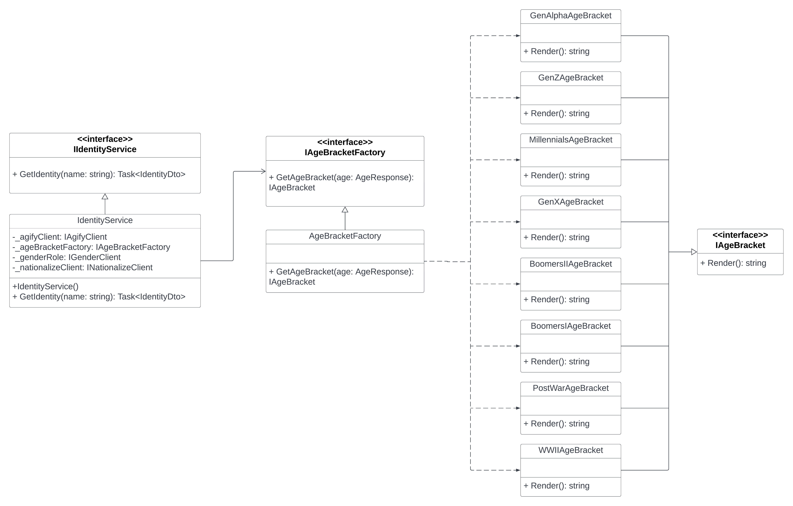

# CSIT340-final-project-Unit-Testing

# Group 5olid Identity Web API Project

Identity API is a Web API using ASP.NET Core made for you to identify people accordingly with its details `Gender`, `Country`, `Age` and `AgeBracket` by just inputting a random name.

Using 1 endpoint `GET /api/identities/?name={User Input Name}`

The image below is our reference which as you could see Gender, Country and Age are just random with the help of the provided links.

Lastly, this project is also deployed in a live environment (`Azure`).

## 1. Controllers
We modified `IdentityController.cs` which should have try catch incase it would throw an `Exception` or `BadRequest`.

## 2. Factory ##

To generate the age brackets, we utilized the `Factory Method` in which we created:

  - `AgeBracket` folder containing the interface `IAgeBracket` and its concrete subclasses which are the:
    - `BoomersI`, `BoomersII`, `GenAlpha`, `GenX`, `Genz`, `Millennials`, `PostWar`, `WWII`

  - `IAgeBracketFactory` which serves as the Abstract Factory that would generate the age bracket

  - `AgeBracketFactory` which is a concrete subclass implementing the `IAgeBracketFactory`

## 3. DTO
We added the IdentityDto which has all the ff properties:
`Name`, `Gender`, `Country`, `Age`, and `AgeBracket`.

## 4. Services 
`IdentityService` and its interface `IIdentityService` which both have the method `Task<IdentityDto> GetIdentity(string name)`

## 5. Responses
`GenderResponse`,`CountryResponse`, and `AgeResponse`
 has properties of int `Age`, string `Gender`, and for `Country` it is a `List`

## 6. Clients
3 Interfaces `IAgifyClient`, `IGenderClient`, and `INationalizeClient` which all are using `Refit`.

## 7. Program.cs
Add configurations in order for the `Identity API` to run.

## 8. Identity Test ## 
Using `xUnit Test Project`, we created necessary unit tests for our factory, service, and controller.

Add a new `Factory` folder for Factory Unit Test
-Create `AgeBracketFactoryTests` and its implementation.
  - `GetAgeBracket_ValidAge_ReturnsAgeGeneration()` - A unit test to check if it is in the right generation. It `returns` specific age generation.

Add a new `Services` folder for Service Unit Test
- Create `IIdentityServiceTests` and it's implementation.
  - `Task GetIdentity_ValidMaleName_ReturnMaleGender()` - A unit test to check if it is a male gender. It `returns` male as gender.
  - `Task GetIdentity_ValidFemaleName_ReturnFemaleGender()` - A unit test to check if it is a female gender. It `returns` female as gender.
  - `Task GetIdentity_ValidName_ReturnCorrectAge()` - A unit test to check if it is a correct age. It `returns` age.
  - `Task GetIdentity_ValidName_ReturnCorrectAgeBracket()` - A unit test to check if it in a correct age bracket. It `returns` age bracket.
  - `Task GetIdentity_ValidName_ReturnCorrectCountry()` - A unit test to check if it is a correct country. It `returns` country.
  - `Task GetIdentity_ValidName_ReturnCorrectIdentity()` - A unit test to check if it is a correct identity. It `returns` an identity.

Add a new `Controller` folder for Controller Unit Test
- Create `IdentityControllerTests` and it's implementation.
  - `Task GetIdentity_ValidName_ReturnsOk()` - A unit test to check if it is a male gender. It `returns` Ok (200).
  - `Task GetIdentitt_InvalidName_ReturnsBadRequest()` - A unit test to check if it is a female gender. It `returns` BadRequest (400).
  - `Task GetIdentity_Exception_ReturnsServerError()` - A unit test to check if it is a correct age. It `returns` ServerError (500).

## 9. AZURE ##  
 Using Endpoint
 - https://5olid-identityapp.azurewebsites.net/api/identities?name={name}

 Swagger UI
 - https://5olid-identityapp.azurewebsites.net/swagger/index.html

  
Prepared by:

*Yours Truly,*\
GROUP 5olid

***MEMBERS:***
- **Alys Carillo**
- **Ginalyn Caneda**
- **Hareram Chua**
